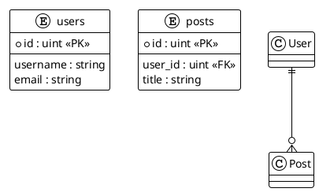

<!-- @ai:document type="api_reference" service="servicedoc" version="0.1.0" lang="ru" -->
# API — servicedoc

## Модели данных (Pydantic)

<!-- @ai:section type="class" id="PipelineContext" -->
### PipelineContext

<!-- @ai:field name="description" -->
Центральный объект состояния пайплайна. Передаётся между всеми этапами анализа.
Каждый этап читает из контекста нужные данные и записывает свои результаты.
<!-- @ai:end -->

<!-- @ai:field name="source" -->
**Файл:** `servicedoc/models/pipeline.py`
<!-- @ai:end -->

<!-- @ai:field name="schema" format="json" -->
```json
{
  "repo_config": "RepoConfig",
  "work_dir": "Path",
  "output_dir": "Path",
  "local_repo_path": "Path | null",
  "detected_language": "go | python | mixed | null",
  "all_source_files": "list[Path]",
  "symbols": "list[Symbol]",
  "external_deps": "list[ExternalDep]",
  "proto_services": "list[ProtoService]",
  "er_entities": "list[EREntity]",
  "er_relations": "list[ERRelation]",
  "er_diagram": "string | null",
  "coverage_result": "CoverageResult | null",
  "git_history": "list[ChangelogEntry]",
  "git_tags": "list[string]",
  "stage_results": "list[StageResult]"
}
```
<!-- @ai:end -->
<!-- @ai:end -->

<!-- @ai:section type="class" id="Symbol" -->
### Symbol / FunctionSymbol / ClassSymbol

<!-- @ai:field name="description" -->
Иерархия моделей публичных символов кода. `Symbol` — базовый класс.
`FunctionSymbol` добавляет параметры и типы возврата. `ClassSymbol` — методы и поля.
<!-- @ai:end -->

<!-- @ai:field name="source" -->
**Файл:** `servicedoc/models/symbols.py`
<!-- @ai:end -->

<!-- @ai:field name="schema" format="json" -->
```json
{
  "name": "string",
  "kind": "function | method | class | interface | struct | type_alias",
  "file_path": "Path",
  "line_start": "int",
  "line_end": "int",
  "is_public": "bool",
  "comment": "string | null",
  "ai_description": "string | null",
  "needs_ai": "bool",
  "parameters": "[{name, type_ref}]",
  "return_types": "[TypeRef]",
  "receiver": "string | null"
}
```
<!-- @ai:end -->
<!-- @ai:end -->

<!-- @ai:section type="class" id="EREntity" -->
### EREntity / ERRelation

<!-- @ai:field name="description" -->
Модели для ER-диаграмм. `EREntity` описывает таблицу/модель БД.
`ERRelation` описывает связь между сущностями (one_to_one, one_to_many, many_to_many).
<!-- @ai:end -->

<!-- @ai:field name="source" -->
**Файл:** `servicedoc/models/er.py`
<!-- @ai:end -->
<!-- @ai:end -->

## Pipeline

<!-- @ai:section type="class" id="Stage" -->
### Stage (ABC)

<!-- @ai:field name="description" -->
Абстрактный базовый класс этапа пайплайна. Все 9 этапов реализуют этот интерфейс.
Атрибут `required=False` делает этап необязательным — его ошибка не останавливает пайплайн.
<!-- @ai:end -->

<!-- @ai:field name="source" -->
**Файл:** `servicedoc/pipeline/base.py`
<!-- @ai:end -->

<!-- @ai:field name="interface" format="python" -->
```python
class Stage(ABC):
    name: ClassVar[str]
    required: ClassVar[bool] = True

    async def run(self, ctx: PipelineContext) -> StageResult: ...
    async def validate_input(self, ctx: PipelineContext) -> bool: ...
```
<!-- @ai:end -->
<!-- @ai:end -->

<!-- @ai:section type="class" id="PipelineRunner" -->
### PipelineRunner

<!-- @ai:field name="description" -->
Оркестратор пайплайна. Запускает этапы последовательно, передавая `PipelineContext`.
Обрабатывает пропуск этапов через `config.skip_stages`. Фатальные ошибки обязательных
этапов прерывают выполнение через `PipelineFatalError`.
<!-- @ai:end -->

<!-- @ai:field name="source" -->
**Файл:** `servicedoc/pipeline/runner.py`
<!-- @ai:end -->

<!-- @ai:field name="request" format="python" -->
```python
runner = PipelineRunner(stages, config)
ctx: PipelineContext = await runner.run(RepoConfig(url="...", branch="main"))
```
<!-- @ai:end -->
<!-- @ai:end -->

## Parsers

<!-- @ai:section type="class" id="GoParser" -->
### GoParser

<!-- @ai:field name="description" -->
tree-sitter парсер Go-кода. Извлекает экспортированные функции (заглавная буква),
методы с receiver, интерфейсы и структуры. Комментарии извлекаются backward scan от
строки объявления. Работает async через `asyncio.to_thread` для CPU-bound операций.
<!-- @ai:end -->

<!-- @ai:field name="source" -->
**Файл:** `servicedoc/parsers/go/parser.py`
<!-- @ai:end -->

<!-- @ai:field name="queries" format="text" -->
Использует tree-sitter Scheme запросы (см. `servicedoc/parsers/go/queries.py`):
- `QUERY_FUNCTIONS` — функции верхнего уровня
- `QUERY_METHODS` — методы с receiver
- `QUERY_STRUCTS` — структуры (экспортированные)
- `QUERY_IMPORTS` — импортные пути
<!-- @ai:end -->
<!-- @ai:end -->

<!-- @ai:section type="class" id="PythonParser" -->
### PythonParser

<!-- @ai:field name="description" -->
tree-sitter парсер Python-кода. Извлекает публичные функции (без `_` prefix),
классы с базовыми классами и декораторами. Docstrings извлекаются через
QUERY_DOCSTRINGS (первый string literal в теле функции/класса).
<!-- @ai:end -->

<!-- @ai:field name="source" -->
**Файл:** `servicedoc/parsers/python/parser.py`
<!-- @ai:end -->
<!-- @ai:end -->

## AI Client

<!-- @ai:section type="class" id="AIClient" -->
### AIClient

<!-- @ai:field name="description" -->
Async HTTP клиент для OpenAI-compatible API (`/v1/chat/completions`). Поддерживает
батчевую обработку символов (N символов в один запрос), rate limiting через
`TokenBucketRateLimiter`, retry с exponential backoff на HTTP 429/503.
<!-- @ai:end -->

<!-- @ai:field name="source" -->
**Файл:** `servicedoc/ai/client.py`
<!-- @ai:end -->

<!-- @ai:field name="request" format="json" -->
```json
{
  "model": "gpt-4o",
  "max_tokens": 2048,
  "messages": [
    {"role": "system", "content": "...system prompt..."},
    {"role": "user", "content": "...batch of symbols as JSON..."}
  ]
}
```
<!-- @ai:end -->

<!-- @ai:field name="response" format="json" -->
```json
["описание символа 1 на русском", "описание символа 2 на русском", ...]
```
<!-- @ai:end -->
<!-- @ai:end -->

## ER Detection

<!-- @ai:section type="class" id="ORMDetectors" -->
### GoGORMDetector / PySQLAlchemyDetector / RawSQLDetector

<!-- @ai:field name="description" -->
Стратегии детектирования DB-сущностей. `GoGORMDetector` ищет Go-структуры с тегами
`gorm:`. `PySQLAlchemyDetector` ищет классы наследующие `Base`/`DeclarativeBase`.
`RawSQLDetector` ищет `FROM`/`JOIN`/`INSERT INTO` в строках SQL (помечает `is_inferred=True`).
<!-- @ai:end -->

<!-- @ai:field name="source" -->
**Файл:** `servicedoc/er/detector.py`
<!-- @ai:end -->
<!-- @ai:end -->

## ER Renderer

<!-- @ai:section type="class" id="PlantUMLRenderer" -->
### PlantUMLRenderer

<!-- @ai:field name="description" -->
Генерирует PlantUML `erDiagram` из списков `EREntity` и `ERRelation`.
Пунктирные стрелки (`..`) для `is_inferred=True` (из raw SQL).
Сплошные стрелки (`--`) для ORM-обнаруженных связей.
<!-- @ai:end -->

<!-- @ai:field name="source" -->
**Файл:** `servicedoc/er/renderer.py`
<!-- @ai:end -->

<!-- @ai:field name="output_example" format="plantuml" -->

<!-- @ai:end -->
<!-- @ai:end -->

## CLI

<!-- @ai:section type="cli_command" id="analyze" -->
### servicedoc analyze

<!-- @ai:field name="description" -->
Основная команда. Клонирует репозиторий, запускает пайплайн из 9 этапов,
генерирует документацию в указанную директорию.
<!-- @ai:end -->

<!-- @ai:field name="usage" format="shell" -->
```bash
servicedoc analyze <URL> [OPTIONS]

Аргументы:
  URL                Git URL репозитория (обязательно)

Опции:
  --branch, -b TEXT  Ветка для клонирования [default: main]
  --output, -o PATH  Директория вывода [default: ./servicedoc_output]
  --skip, -s TEXT    Этапы для пропуска (повторять для нескольких)
  --config, -c PATH  Путь к .env файлу конфигурации
```
<!-- @ai:end -->

<!-- @ai:field name="example" format="shell" -->
```bash
# Базовый запуск
servicedoc analyze https://github.com/company/service

# С пропуском AI-обогащения
servicedoc analyze https://github.com/company/service --skip s06_ai_enrich

# С кастомным конфигом
servicedoc analyze https://gitlab.corp.com/team/service \
  --branch develop \
  --output ./output \
  --config /etc/servicedoc/.env
```
<!-- @ai:end -->
<!-- @ai:end -->

## REST API

<!-- @ai:section type="rest_endpoint" id="POST_v1_analyze" -->
### POST /v1/analyze

<!-- @ai:field name="description" -->
Запускает анализ репозитория асинхронно. Доступен при установке с extras `[api]`
и запуске через `servicedoc serve`.
<!-- @ai:end -->

<!-- @ai:field name="request" format="json" -->
```json
{
  "url": "https://github.com/company/service",
  "branch": "main",
  "output_dir": "./servicedoc_output",
  "skip_stages": []
}
```
<!-- @ai:end -->

<!-- @ai:field name="response" format="json" -->
```json
{
  "status": "ok",
  "output_dir": "/abs/path/servicedoc_output",
  "stages_succeeded": 9,
  "stages_total": 9
}
```
<!-- @ai:end -->
<!-- @ai:end -->
<!-- @ai:end -->
