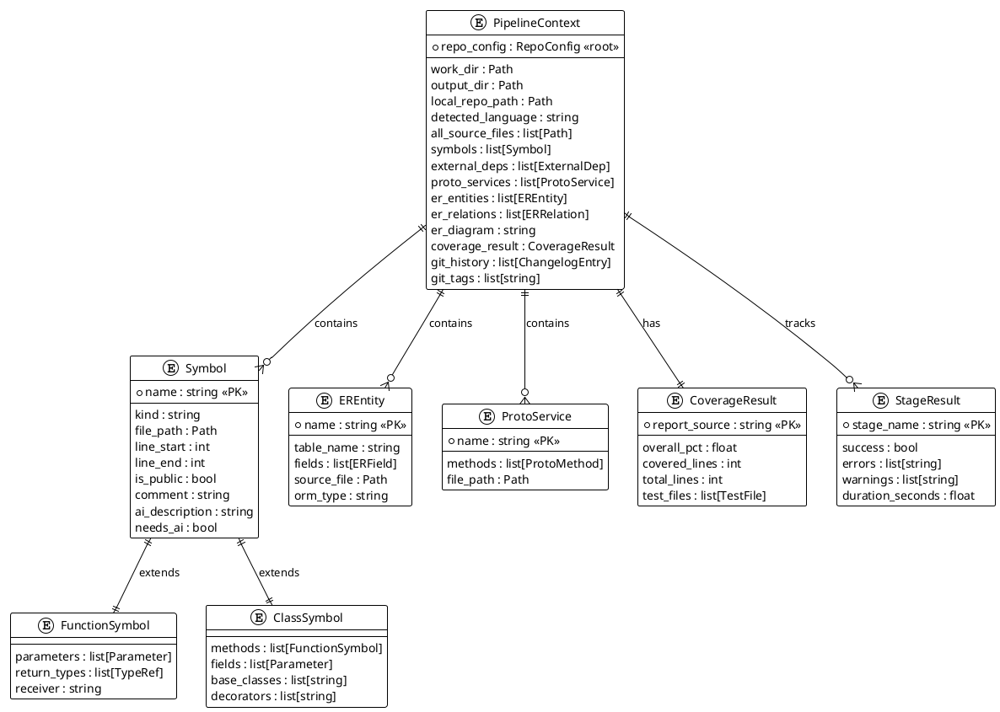

<!-- @ai:document type="er_diagram" service="servicedoc" lang="ru" -->
# Внутренние модели данных — servicedoc

> servicedoc не использует внешнюю БД. Ниже описаны основные Pydantic-модели,
> которые образуют внутреннюю схему данных сервиса.

<!-- @ai:section type="er_diagram" format="plantuml" -->

<!-- @ai:end -->

## Описание моделей

<!-- @ai:section type="table_description" id="PipelineContext" -->
### PipelineContext

Центральный контейнер состояния. Создаётся `PipelineRunner` в начале запуска
и передаётся каждому этапу. Каждый этап мутирует контекст — добавляет символы,
ER-сущности, proto-сервисы и т.д.

**Источник:** `servicedoc/models/pipeline.py`
<!-- @ai:end -->

<!-- @ai:section type="table_description" id="Symbol" -->
### Symbol / FunctionSymbol / ClassSymbol

Иерархия публичных символов кода. `Symbol` — абстрактный базовый класс.
`needs_ai=True` устанавливается в s05_comments если комментарий отсутствует.
`ai_description` заполняется в s06_ai_enrich.

**Источник:** `servicedoc/models/symbols.py`
<!-- @ai:end -->

<!-- @ai:section type="table_description" id="EREntity" -->
### EREntity / ERRelation

Модели для построения ER-диаграммы. Наполняются в s08_er детекторами
`GoGORMDetector`, `PySQLAlchemyDetector`, `RawSQLDetector`.
`is_inferred=True` для таблиц обнаруженных из raw SQL (менее надёжно).

**Источник:** `servicedoc/models/er.py`
<!-- @ai:end -->
<!-- @ai:end -->
