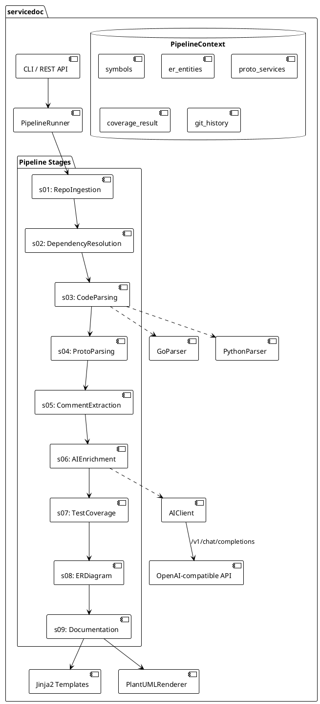

<!-- @ai:document type="service_readme" service="servicedoc" version="0.1.0" lang="ru" -->
# servicedoc

<!-- @ai:section type="overview" -->
**Назначение:** Python-сервис автоматического анализа исходного кода (Go/Python) и генерации
структурированной технической документации. Принимает URL git-репозитория, клонирует его,
анализирует AST через tree-sitter, извлекает публичные символы с типами, парсит .proto-файлы,
строит ER-диаграммы баз данных и генерирует документацию в ai-ready Markdown-формате.

**Язык:** Python 3.12+ | **Протокол:** CLI (typer) + REST (FastAPI, опционально)

| Характеристика | Значение |
|---|---|
| Версия | 0.1.0 |
| Язык реализации | Python 3.12+ |
| Поддерживаемые языки анализа | Go, Python |
| Публичных этапов пайплайна | 9 |
| Внешних зависимостей core | 9 |
| Покрытие unit-тестами | 21 тест |

<!-- @ai:end -->

## Содержание

- [API](./API.md) — публичные классы, функции и модели данных
- [Архитектура](./ARCHITECTURE.md) — этапы пайплайна и поток данных
- [Конфигурация](./CONFIG.md) — переменные окружения и настройки
- [Тесты](./TESTS.md) — покрытие и запуск тестов
- [ER-диаграмма](./ER.md) — внутренние модели данных сервиса
- [CHANGELOG](./CHANGELOG.md) — история изменений

## Быстрый старт

```bash
# Установка
pip install servicedoc

# Анализ репозитория
servicedoc analyze https://gitlab.company.com/team/my-service --output ./docs

# Результат
./docs/
├── README.md      # Обзор сервиса
├── API.md         # Публичные символы с типами
├── TESTS.md       # Покрытие тестами
├── ER.md          # ER-диаграмма БД (PlantUML)
├── CHANGELOG.md   # История коммитов по тегам
└── RELEASE_NOTES/ # Заметки к каждому релизу (AI-анализ)
    ├── v1.0.0.md
    └── v1.1.0.md
```

## Архитектура пайплайна

<!-- @ai:section type="architecture" -->

<!-- @ai:end -->

## Поток данных

<!-- @ai:section type="data_flow" -->
1. **Входные данные:** URL git-репозитория + токены авторизации
2. **s01 Ingest:** Clone → определение языка → список файлов
3. **s02 Deps:** Парсинг go.mod/pyproject.toml → клонирование внешних git-зависимостей → импортный фильтр (только используемые файлы)
4. **s03 Parse:** tree-sitter AST → `Symbol` объекты с параметрами и типами возврата
5. **s04 Proto:** stdlib re-парсер .proto → `ProtoService`/`ProtoMessage` → JSON схемы
6. **s05 Comments:** Обратный скан комментариев → `needs_ai=True` при отсутствии
7. **s06 AI:** Батчевые запросы к OpenAI-compatible API → русские описания символов
8. **s07 Tests:** Поиск coverage.xml/.coverage/lcov.info → `CoverageResult`
9. **s08 ER:** GORM/SQLAlchemy/raw SQL детектирование → PlantUML диаграмма
10. **s09 Docs:** Jinja2 рендеринг → README/API/TESTS/ER/CHANGELOG/RELEASE_NOTES
<!-- @ai:end -->

## Внешние зависимости core

<!-- @ai:section type="external_deps" -->
| Пакет | Версия | Назначение |
|---|---|---|
| tree-sitter | ≥0.23 | AST-парсинг (engine) |
| tree-sitter-go | ≥0.23 | Грамматика Go |
| tree-sitter-python | ≥0.23 | Грамматика Python |
| pydantic | ≥2.7 | Модели данных + валидация |
| pydantic-settings | ≥2.3 | Конфигурация из env |
| gitpython | ≥3.1 | Клонирование + git log |
| httpx | ≥0.27 | Async HTTP клиент для AI API |
| Jinja2 | ≥3.1 | Рендеринг шаблонов документов |
| typer | ≥0.12 | CLI интерфейс |

**Stdlib-реализации** (без внешних зависимостей):
- Retry/backoff: `asyncio` + `httpx`
- Кэш: `shelve` + `hashlib`
- Proto-парсер: `re` (конечный автомат)
- Changelog dedup: `difflib.SequenceMatcher`
- PlantUML: строки (нет доп. библиотек)
<!-- @ai:end -->
<!-- @ai:end -->
